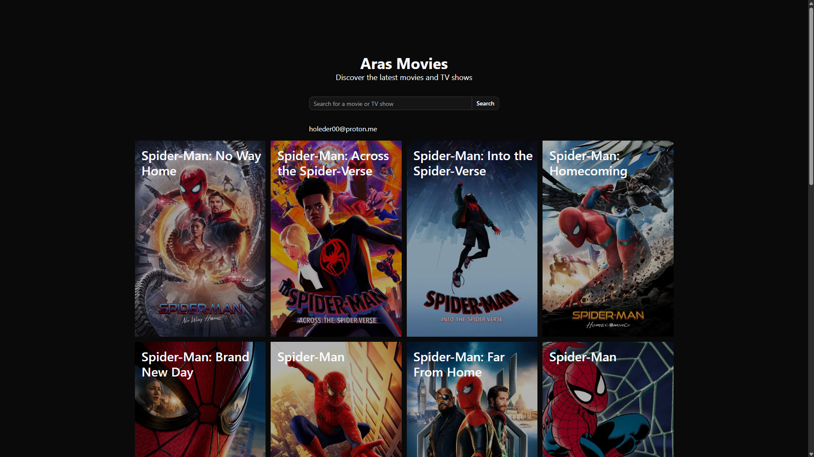
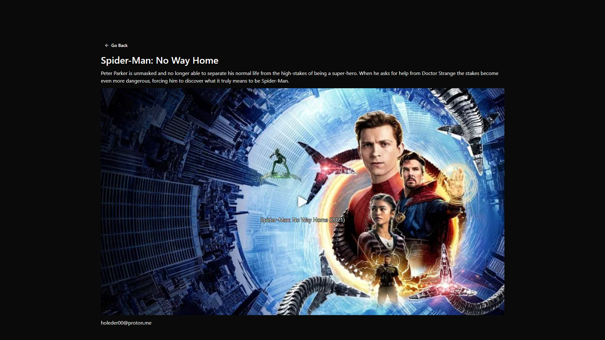

# 🎬 Aras Movies

A modern, fast, and user-friendly movie & TV show discovery platform.  
Built with Next.js.

----------

## 🚀 Features

-   🎥 Browse movies and TV shows
    
-   🔍 Search functionality
    
-   ⚡ Fast page transitions (SSR / App Router)
    
-   📱 Fully responsive design


----------

## 📸 Screenshots

### 🏠 Home Page



### 🎬 Movie Page



----------

## 🛠️ Tech Stack

-   ⚛️ React
    
-   ▲ Next.js
    
-   🎨 Tailwind CSS
    
-   🔔 shadcn/ui
    
-   🌐 API Integration
----------

## 📦 Installation

To run the project locally:

```bash
# clone the repository
git clone https://github.com/arasemr12/arasmovie.git

# navigate into the project
cd arasmovie

# install dependencies
yarn install

# start development server
yarn dev
```

Open in your browser:  
👉 [http://localhost:3000](http://localhost:3000)

----------

## ⚙️ Environment Variables

Copy the example file:

```bash
cp .env.example .env
```

Add your API keys:

```env
NEXT_PUBLIC_API_URL=your_api_url
```

Copy the api example file:

```bash
cd api
cp .env.example .env
```

Add your API keys:

```env
TMDB_API_KEY="your_tmdb_api_key"
```

----------

## 📁 Project Structure

```
/src/app
/src/components
/src/lib
/src/types
/public
/api
/api/routes
```

----------

## 🌍 Deployment

This project can be easily deployed on:

-   ▲ Vercel (recommended)
    
-   Netlify
    
-   VPS (Nginx + Node.js)
    

----------

## ⚠️ Disclaimer

This project is intended for educational and portfolio purposes only.  
All content is provided via third-party APIs.

----------

## 📄 License

MIT License

----------

## 👤 Author

**arasemr1234**

-   GitHub: [https://github.com/arasemr12](https://github.com/arasemr12)
    

----------
